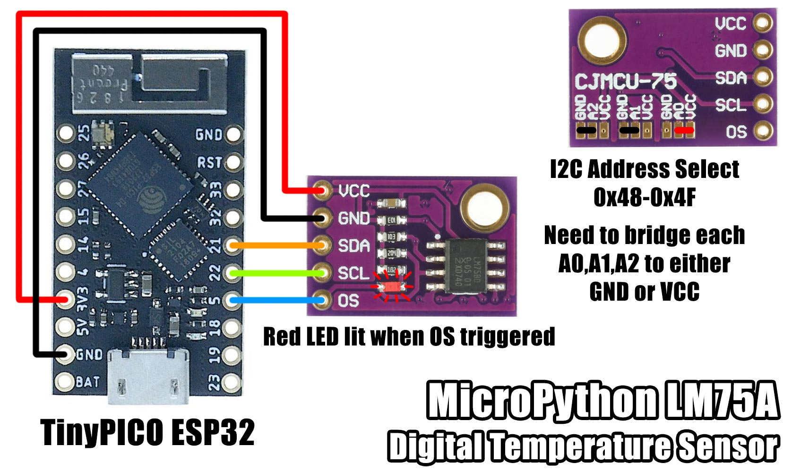

# MicroPython LM75A Digital Temperature Sensor

A MicroPython library for interfacing with an [NXP LM75A](https://www.nxp.com/products/sensors/ic-digital-temperature-sensors/digital-temperature-sensor-and-thermal-watchdog:LM75A) I2C digital temperature sensor and thermal watchdog.

This sensor is featured on the CJMCU-75 module.



The NXP version of LM75A has 11 temperature bits, improving the precision from 0.5°C to 0.125°C with a temperature range of -55 to 125°C.

The device operates in two modes normal and shutdown.

In normal mode, the temperature is calculated every 100ms and saved to the temperature register.

In shutdown mode, the temperature register contains the last known value and the ADC and comparator are idle to reduce power consumption.
The device remains active on the I2C bus for reads and writes.

There are two temperature thresholds over-temperature shutdown (Tos) and hysteresis (Thyst).
After the temperature is calculated in normal mode, the value is compared with the threshold values Tos and Thyst to trigger OS output.

The temperature value has 11-bit precision (0.125°C per bit), however the Tos and Thyst values are 9-bit (0.5°C per bit).
When comparing the temperature with the thresholds, the 9 most significant bits of temperature are used.

The OS output (over-temperature shutdown) can be configured to run as a comparator (default) or as an interrupt.

In comparator mode, OS behaves like a thermostat and becomes active and holds when the temperature exceeds Tos and only deactivates once the temperature falls below Thyst.
A real world example for using comparator mode would be to switch on a fan once the temperature exceeds Tos, then switch it off once the temperature falls below Thyst.

In interrupt mode, OS activates when the temperature exceeds the Tos value and remains active until any register is read.
It will only retrigger once the temperature falls below Thyst, where it OS goes active again until any register is read.

In both cases OS output is only activated after a programmable number of consecutive faults.
To help reduce noise, there is a fault queue for counting consecutive faults.

The OS output polarity can also be configured.
On the CJMCU-75 module, when OS is active, the onboard red LED illuminates.

Tos temperature must be greater than Thyst, otherwise the OS output is erratic.

Power on defaults: Normal mode, OS comparator mode, Tos: 80°C, Thyst: 75°C, OS output active LOW


#### Examples

**Basic Usage**

```python
import lm75a
from machine import I2C, Pin
i2c = I2C(scl=Pin(22), sda=Pin(21))
sensor = lm75a.LM75A(i2c)

# Single measurement
print(sensor.temp())

# Continuous measurement
while True:
	print(sensor.temp())
	time.sleep_ms(100)

# Using interrupts
os = Pin(5, Pin.IN, Pin.PULL_UP)

def os_int(pin):
	print("IRQ: Temp < Thyst" if pin.value() == 1 else "IRQ: Temp > Tos")

os.irq(handler=os_int, trigger=Pin.IRQ_FALLING | Pin.IRQ_RISING)

last = 0
while True:
	t = sensor.temp()
	if t != last:
		print(t)
		last = t
	time.sleep_ms(100)

# Disable os interrupt
os.irq(handler=None, trigger=Pin.IRQ_FALLING | Pin.IRQ_RISING)

# Shutdown mode
sensor.config(shutdown=1)
# Reduced power consumption mode. Reading the temp register returns the last known value.

# Normal mode
sensor.config(shutdown=0)
# Back online, temperature read every 100ms.

# Set OS comparator mode
sensor.config(os_mode=0)
# In this mode, os is active when temp has exceeded Tos and inactive when temp dropped below Thyst.

# Set Thyst temperature (-55 to 125°C)
sensor.thyst(24)
# When temp goes below 24°C, os deactivates.

# Set Tos temperature (-55 to 125°C)
sensor.tos(27)
# When temp goes above 27°C, os activates.

# Set OS polarity
sensor.config(os_polarity=1)
# 1 means os is active HIGH.
# 0 means os is active LOW.

# Set OS interrupt mode
sensor.config(os_mode=1)
# In this mode, os goes active when the temp crosses thyst or tos, and holds until any register is read.
# After clearing the tos crossing interrupt, it wont fire on another tos crossing until first crossing thyst,
# where it holds active again until any register is read.
```

#### Pins

Pin | Name | Description
:--:|:----:|:--------------------------------
1   | VCC  | Power supply 2.8 to 5.5V
2   | GND  | Ground
3   | SDA  | I2C serial data
4   | SCL  | I2C serial clock
5   | OS   | Over-temp shutdown output
6   | A0   | I2C address bit 0
7   | A1   | I2C address bit 1
8   | A2   | I2C address bit 2

# Methods

## __init__(i2c=None, address=0x48)

Initialise the driver. Set default configuration.

## config(shutdown=None, os_mode=None, os_polarity=None, os_fault_queue=None)

Configure shutdown, os_mode, os_polarity, os_fault_queue.

shutdown: 0=normal, 1=shutdown

os_mode: 0=comparator, 1=interrupt

os_polarity: 0=active LOW, 1=active HIGH

os_fault_queue: 0=1x consecutive fault, 1=2x consecutive faults, 2=4x consecutive faults, 3=6x consecutive faults

## check()

Scans the I2C bus for matching device and raises an error if not found.

## temp()

Reads the temperature from the temperature register -55 to 127°C in 0.125°C increments.

## tos(temp=75)

Sets the Tos temperature -55 to 125°C in 0.5°C increments.

## thyst(temp=80)

Sets the Thyst temperature -55 to 125°C in 0.5°C increments.

## _twos_comp(val, bits)

Helper for converting 2s complement register values to temperatures.

## _rev_twos_comp(val, bits)

Helper for converting temperatures to 2s complement register values.

## _temp_to_9bit_reg(temp)

Helper for converting Tos and Thyst temperatures to how they are stored in the register.


## I2C interface

This sensor uses an I2C interface and requires pull-ups on the SDA and SCL lines. The CJMCU-75 modules has these onboard.

### I2C address

The device can be found at addresses 0x48 through 0x4F based on address select pins A0, A1, A2.

A0  | A1  | A2  | Address
----|-----|-----|--------
GND | GND | GND | 0x48
VCC | GND | GND | 0x49
GND | VCC | GND | 0x4A
VCC | VCC | GND | 0x4B
GND | GND | VCC | 0x4C
VCC | GND | VCC | 0x4D
GND | VCC | VCC | 0x4E
VCC | VCC | VCC | 0x4F

## Parts

* [TinyPICO](https://www.tinypico.com/) $20.00 USD
* [Lolin D1 Mini Pro](https://www.aliexpress.com/item/32724692514.html) $6.95 AUD
* [CJMCU-75](https://www.aliexpress.com/item/32686562091.html) $0.92 AUD

## Connections

CJMCU-75 | TinyPICO | ESP8266
VCC      | 3V3      | 3V3
GND      | GND      | GND
SDA      | GPIO21   | GPIO4
SCL      | GPIO22   | GPIO5
OS       | GPIO5    | GPIO0

On ESP8266, GPIO0 may have a pull-up, so use another pin if you wish to invert the OS polarity.

If you do not wish to use the OS output, you can leave this pin not connected and just read the temperature register.

## Links

* [NXP LM75A datasheet](https://www.nxp.com/docs/en/data-sheet/LM75A.pdf)
* [micropython.org](http://micropython.org)
* [TinyPICO Getting Started](https://www.tinypico.com/gettingstarted)
* [WeMos D1 Mini](https://wiki.wemos.cc/products:d1:d1_mini)

## License

Licensed under the [MIT License](http://opensource.org/licenses/MIT).

Copyright (c) 2019 Mike Causer
